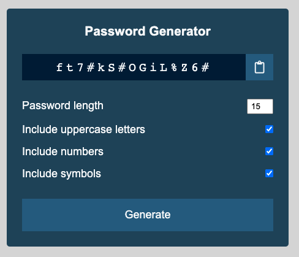

# JavaScript Password Generator
In this project, you will develop a random password generator in JavaScript.

## Objectives
* Respond to events generated by the user in the browser.
* Utilize the Math library to generate random data.
* Access and manipulate elements via the DOM API.
* Understand how to copy in-program data to the clipboard.

## Instructions
Develop a JavaScript web application which generates a random password of the supplied length and additional options. A screenshot of the finished application is shown below.

The generated password should meet the following criteria:
* Be of the specified length, but must be between 6 and 20 characters.
* Include all lowercase characters by default.
* Inlcude uppercase letters (if selected).
* Include nunmbers (if selected).
* Include symbols (if selected). The possible symbols are `!` `#` `$` `%` `&` `)` `(`

If additional character groups (aside from the default lowercase) are included, each character group should have an equal probability of being used in each character position.

After the password is generated, it should be displayed in the top-most input element (which is being used for output in this case).

A user should also be able to click the "clipboard" button/icon to copy the password to the system clipboard, so that it may be pasted into an application. For a reference on how to do this, see https://www.w3schools.com/howto/howto_js_copy_clipboard.asp.

You should use the supplied `index.html` and `css/styles.css` for your finished application (do not modify). Only modify `js/app.js` for your implemenation.

## Tips & Hints
Pieces of code and comments are provided throughout `js/app.js` to give you guidance in completing this assignment.

To generate the random characters, you will be using Math.floor() and Math.random() as discussed in class. Reference the ASCII table at https://www.rapidtables.com/code/text/ascii-table.html for character code ranges. Don't forget that before you return from each of the password generation functions, you will need to convert the generated character code to a string with `String.fromCharCode(number))`. This applies to the lowercase and uppercase functions.

As you generate each character of the password, you will want to look at the options that are selected, and make sure to generate uppercase, lowercase, numbers, and symbols (only the options selected) with equal probablity for each position. The implemenation is up to you and this will probably be the trickiest part. For my implementation, I built an array of functions corresponding to the selected character options, and then chose a random function for each character.

## Submission
Push your commits to GitHub and submit the project in Blackboard along with your repository URL.

